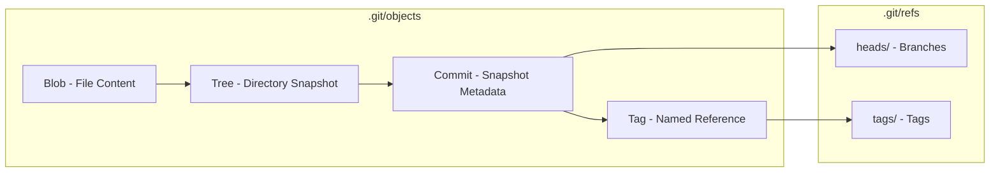

# 50 Git Essentials for Developers

This guide categorizes 50 of the most critical Git commands based on real-world use cases and the specific development problems they solve. Whether you are managing complex branch structures, resolving conflicts, or selectively moving commits between environments, these commands form the foundation of a robust version control workflow.

## 1. Setup & Initialization

**Problem Solved:** Configuring your local Git environment and starting new repositories.

| Command                                    | Problem it Solves / Use Case                                                                          |
| :----------------------------------------- | :---------------------------------------------------------------------------------------------------- |
| `git config --global user.name "[name]"`   | Sets the author name attached to your commits.                                                        |
| `git config --global user.email "[email]"` | Sets the author email attached to your commits.                                                       |
| `git init`                                 | Initializes a new, empty Git repository in the current directory.                                     |
| `git clone [url]`                          | Downloads an entire repository from a remote server (like Bitbucket or GitHub) to your local machine. |

## 2. Basic Snapshotting

**Problem Solved:** Tracking changes, staging files, and saving your work to the local history.

| Command                         | Problem it Solves / Use Case                                                                        |
| :------------------------------ | :-------------------------------------------------------------------------------------------------- |
| `git status`                    | Shows which files are modified, staged for commit, or untracked.                                    |
| `git add [file]`                | Stages a specific file, preparing it to be included in the next commit.                             |
| `git add .`                     | Stages all modified and new files in the current directory.                                         |
| `git commit -m "[message]"`     | Saves the staged changes into the local repository history with a descriptive message.              |
| `git commit --amend -m "[msg]"` | Modifies the very last commit (useful for fixing a typo in the message or adding a forgotten file). |
| `git log`                       | Displays the chronological commit history for the current branch.                                   |
| `git log --oneline --graph`     | Shows a compact, visual representation of the commit history and branching structure.               |

## 3. Branch Management

**Problem Solved:** Isolating experimental work, managing feature development, and organizing team workflows.

| Command                         | Problem it Solves / Use Case                                                                      |
| :------------------------------ | :------------------------------------------------------------------------------------------------ |
| `git branch`                    | Lists all local branches and highlights the one you are currently on.                             |
| `git branch [branch-name]`      | Creates a new branch pointing to the current commit, but does not switch to it.                   |
| `git checkout [branch-name]`    | Switches your working directory to the specified branch.                                          |
| `git checkout -b [branch-name]` | Creates a new branch and immediately switches to it (combines the two commands above).            |
| `git switch [branch-name]`      | A newer, safer alternative to `checkout` purely for switching branches.                           |
| `git switch -c [branch-name]`   | Creates and switches to a new branch using the newer syntax.                                      |
| `git branch -m [old] [new]`     | Renames a local branch. Highly useful if you made a typo in a feature branch name before pushing. |
| `git branch -d [branch-name]`   | Safely deletes a local branch (prevents deletion if it contains unmerged changes).                |
| `git branch -D [branch-name]`   | Forcefully deletes a local branch, regardless of its merge status.                                |

## 4. Merging & Integration

**Problem Solved:** Combining isolated feature branches back into the main codebase.

| Command                      | Problem it Solves / Use Case                                                                                           |
| :--------------------------- | :--------------------------------------------------------------------------------------------------------------------- |
| `git merge [branch-name]`    | Merges the specified branch's history into your current working branch.                                                |
| `git merge --abort`          | Stops a merge process and restores the project state if you encounter complex conflicts you aren't ready to resolve.   |
| `git merge --no-ff [branch]` | Creates a dedicated merge commit even if a fast-forward was possible, preserving the historical grouping of a feature. |

## 5. Syncing with Remotes

**Problem Solved:** Sharing your local commits with the team or pulling down the latest changes from the central repository.

| Command                       | Problem it Solves / Use Case                                                                                            |
| :---------------------------- | :---------------------------------------------------------------------------------------------------------------------- |
| `git remote -v`               | Lists all configured remote repository URLs (e.g., origin) to verify where your code is pushing/pulling.                |
| `git remote add origin [url]` | Connects your local repository to a remote server URL.                                                                  |
| `git fetch`                   | Downloads new data from the remote repository but does _not_ integrate it into your working files.                      |
| `git pull`                    | Fetches changes from the remote and immediately merges them into your current branch.                                   |
| `git pull --rebase`           | Fetches changes and applies your local commits _on top_ of the incoming changes, keeping a linear history.              |
| `git push`                    | Uploads your local commits to the remote repository.                                                                    |
| `git push -u origin [branch]` | Pushes a new local branch to the remote and sets up the tracking connection for future pulls/pushes.                    |
| `git push --force-with-lease` | Force-pushes changes (often after a rebase) but safely aborts if someone else has pushed to the remote in the meantime. |

## 6. Selective Code Movement (Cherry-Picking & Rebasing)

**Problem Solved:** Moving specific features between branches or rewriting local history for a cleaner project timeline.

| Command                         | Problem it Solves / Use Case                                                                                                                                           |
| :------------------------------ | :--------------------------------------------------------------------------------------------------------------------------------------------------------------------- |
| `git cherry-pick [commit-hash]` | Applies the changes from a specific commit on another branch to your current branch. Perfect for backporting a single hotfix without merging an entire feature branch. |
| `git cherry-pick --continue`    | Resumes the cherry-pick process after you have manually resolved any code conflicts.                                                                                   |
| `git cherry-pick --abort`       | Cancels the cherry-pick operation entirely and returns to the pre-cherry-pick state.                                                                                   |
| `git rebase [branch-name]`      | Re-applies your current branch's commits onto the tip of another branch, smoothing out the history.                                                                    |
| `git rebase -i HEAD~[N]`        | Opens an interactive session to squash, edit, or reorder the last N commits before pushing.                                                                            |
| `git rebase --continue`         | Proceeds with a rebase after you've resolved conflicts mid-operation.                                                                                                  |
| `git rebase --abort`            | Bails out of a rebase that has gotten too messy with conflicts.                                                                                                        |

## 7. Undoing Changes

**Problem Solved:** Rolling back mistakes, un-staging files, or completely discarding local modifications.

| Command                       | Problem it Solves / Use Case                                                                                            |
| :---------------------------- | :---------------------------------------------------------------------------------------------------------------------- |
| `git restore [file]`          | Discards uncommitted local changes in a specific file, reverting it to the last committed state.                        |
| `git restore --staged [file]` | Un-stages a file you accidentally added, but keeps your modifications in the working directory.                         |
| `git reset --soft HEAD~1`     | Undoes the last commit but keeps all those changes staged so you can adjust and re-commit.                              |
| `git reset --hard HEAD~1`     | **Warning:** Completely destroys the last commit and all local changes in those files.                                  |
| `git revert [commit-hash]`    | Creates a _new_ commit that perfectly inverses the changes of a previous commit. The safest way to undo public history. |
| `git clean -fd`               | Removes untracked files and directories from your working tree.                                                         |

## 8. Stashing Work in Progress

**Problem Solved:** Temporarily shelving uncommitted work so you can switch branches to address an urgent issue.

| Command           | Problem it Solves / Use Case                                                                             |
| :---------------- | :------------------------------------------------------------------------------------------------------- |
| `git stash`       | Saves your modified, tracked files onto a stack of unfinished changes and cleans your working directory. |
| `git stash pop`   | Removes the most recent stash from the stack and applies those changes back to your working directory.   |
| `git stash list`  | Shows all the stashed changes you currently have saved.                                                  |
| `git stash apply` | Applies the most recent stash to your working directory but keeps it on the stash list.                  |
| `git stash drop`  | Deletes a specific stash from your list.                                                                 |

## 9. Inspecting, Comparing & Debugging

**Problem Solved:** Figuring out what changed, who changed it, and where a bug was introduced.

| Command                  | Problem it Solves / Use Case                                                                                                                 |
| :----------------------- | :------------------------------------------------------------------------------------------------------------------------------------------- |
| `git diff`               | Shows the exact line-by-line differences between your working directory and the staging area.                                                |
| `git diff --staged`      | Shows the differences between your staged files and the last commit.                                                                         |
| `git show [commit-hash]` | Outputs the metadata and the exact code diff for a specific commit.                                                                          |
| `git blame [file]`       | Annotates each line of a file with the commit hash and author who last modified it. Great for figuring out who to ask about a piece of code. |
| `git bisect start`       | Starts a binary search through your commit history to find exactly which commit introduced a bug.                                            |
| `git bisect good [hash]` | Marks a commit as "good" (bug-free) during a bisect session.                                                                                 |
| `git bisect bad [hash]`  | Marks a commit as "bad" (bug-introducing) during a bisect session.                                                                           |
| `git bisect reset`       | Ends the bisect session and restores HEAD to the original branch.                                                                            |

## 10. Advanced History Rewriting & Patch Management

| Command                                | Problem it Solves / Use Case                                                                                    |
| :------------------------------------- | :-------------------------------------------------------------------------------------------------------------- |
| `git reflog`                           | Displays a log of all HEAD movements (commits, resets, checkouts). **Lifesaver** for recovering "lost" commits. |
| `git reflog expire --expire=now --all` | Forces cleanup of reflog entries (useful after garbage collection).                                             |
| `git gc`                               | Runs garbage collection to optimize repository storage by compressing loose objects.                            |
| `git prune`                            | Removes dangling (unreachable) objects that `gc` might skip.                                                    |
| `git fsck`                             | Checks the integrity of the Git database and reports any corruption or dangling objects.                        |
| `git archive -o project.zip HEAD`      | Creates a zip/tar archive of the repository at a specific commit — no `.git` directory included.                |
| `git format-patch -1 HEAD`             | Generates a patch file for the latest commit (useful for email-based workflows).                                |
| `git apply <file.patch>`               | Applies a patch file to the working directory without recording a commit.                                       |
| `git am <file.patch>`                  | Applies a patch file and commits it (used in mailing-list workflows).                                           |
| `git notes add -m "Note text" HEAD`    | Attaches a note to a commit without altering the commit itself.                                                 |

## 11. Git Internals & Plumbing Commands

| Command                                      | Problem it Solves / Use Case                                                         |
| :------------------------------------------- | :----------------------------------------------------------------------------------- |
| `git hash-object -w <file>`                  | Stores a file as a blob object and returns its SHA-1 hash (low-level plumbing).      |
| `git cat-file -p <hash>`                     | Pretty-prints the content of any Git object (blob, tree, commit, tag) by its SHA.    |
| `git ls-tree HEAD`                           | Lists the tree object referenced by HEAD (shows tracked files and their modes).      |
| `git rev-parse HEAD`                         | Resolves any Git reference (branch, tag, HEAD~3) to its full SHA-1 hash.             |
| `git symbolic-ref HEAD`                      | Prints the current branch name that HEAD points to.                                  |
| `git update-ref refs/heads/main <hash>`      | Low-level way to update a branch reference to point at a specific commit.            |
| `git count-objects -v`                       | Reports the number of loose objects and disk usage in `.git/objects`.                |
| `git verify-pack -v .git/objects/pack/*.idx` | Inspects packed objects and their delta chains.                                      |
| `git ls-files --stage`                       | Shows staged files with their mode, SHA, and stage number (for conflict resolution). |
| `git check-attr -a <file>`                   | Lists all Git attributes applied to a given file.                                    |

## 12. Submodules & Subtrees

| Command                                          | Problem it Solves / Use Case                                                             |
| :----------------------------------------------- | :--------------------------------------------------------------------------------------- |
| `git submodule add <url> <path>`                 | Adds an external repository as a submodule inside your project.                          |
| `git submodule update --init --recursive`        | Clones and checks out all submodules to their recorded commits.                          |
| `git submodule foreach git pull origin main`     | Runs a Git command in every submodule directory.                                         |
| `git subtree add --prefix=<dir> <url> <branch>`  | Merges an external project into your repo as a subtree (no separate `.gitmodules` file). |
| `git subtree pull --prefix=<dir> <url> <branch>` | Pulls latest changes from the external subtree source.                                   |
| `git subtree push --prefix=<dir> <url> <branch>` | Pushes changes from the subtree directory back to its source.                            |

## 13. Worktrees

| Command                                    | Problem it Solves / Use Case                                                                                   |
| :----------------------------------------- | :------------------------------------------------------------------------------------------------------------- |
| `git worktree add ../hotfix hotfix-branch` | Checks out a branch into a separate directory so you can work on two branches simultaneously without stashing. |
| `git worktree list`                        | Lists all linked worktrees and their associated branches.                                                      |
| `git worktree remove <path>`               | Safely removes a linked worktree after ensuring no uncommitted changes.                                        |
| `git worktree prune`                       | Cleans up stale worktree administrative files after manual deletion.                                           |

## 14. Hooks & Automation

| Hook Script          | Trigger                         | Use Case                                                               |
| :------------------- | :------------------------------ | :--------------------------------------------------------------------- |
| `pre-commit`         | Before commit message editor    | Run linters, format checkers, or prevent secrets from being committed. |
| `prepare-commit-msg` | Before commit message is edited | Auto-generate commit messages (e.g., prepend branch name).             |
| `commit-msg`         | After commit message is saved   | Validate commit message format (Conventional Commits).                 |
| `pre-push`           | Before push to remote           | Run full test suite, block pushes to `main`, or check for large files. |
| `pre-receive`        | On remote, before ref update    | Server-side: enforce branch naming, size limits, or access control.    |
| `update`             | On remote, per ref              | Server-side: granular policy per branch (e.g., no force-push to main). |
| `post-receive`       | On remote, after ref update     | Trigger CI/CD, deploy, or notify Slack.                                |
| `post-merge`         | After `git merge` completes     | Auto-commit version bumps or update submodules.                        |

## 15. Advanced Rebase Strategies

| Command / Workflow                           | Problem it Solves / Use Case                                                                                    |
| :------------------------------------------- | :-------------------------------------------------------------------------------------------------------------- |
| `git rebase -i --autosquash HEAD~5`          | Auto-squashes commits whose messages start with `fixup!` or `squash!` into their target.                        |
| `git commit --fixup=<hash>`                  | Creates a fixup commit targeting a specific earlier commit (prep for autosquash).                               |
| `git commit --squash=<hash>`                 | Creates a squash commit targeting a specific earlier commit.                                                    |
| `git rebase --onto <target> <base> <branch>` | Moves a range of commits from one base to another (e.g., transplant a feature branch from `main` to `release`). |
| `git rebase --update-refs`                   | When rebasing, also updates any other branches that point to the rebased commits (Git 2.38+).                   |
| `git rebase --strategy=ours`                 | Forces a rebase to keep your changes in case of conflicts (use with extreme caution).                           |
| `git config --global rebase.autoStash true`  | Automatically stashes and re-applies local changes when rebasing.                                               |

## 16. Large File Storage & Performance

| Command                                                 | Problem it Solves / Use Case                                                             |
| :------------------------------------------------------ | :--------------------------------------------------------------------------------------- |
| `git lfs track "*.psd"`                                 | Tracks large binary files via Git LFS pointer files instead of storing them in the repo. |
| `git lfs migrate import --include="*.zip" --everything` | Converts existing history to use LFS for specified file patterns.                        |
| `git lfs ls-files --all`                                | Lists all files tracked by LFS across all refs.                                          |
| `git clone --filter=blob:none <url>`                    | Partial clone — fetches only commit metadata and downloads blobs on demand (Git 2.19+).  |
| `git clone --depth=1 <url>`                             | Shallow clone — fetches only the latest commit, dramatically reducing clone time.        |
| `git fetch --depth=1`                                   | Converts a shallow clone slightly deeper, or `git fetch --unshallow` to full.            |

## 17. Signing & Security

| Command                                        | Problem it Solves / Use Case                                        |
| :--------------------------------------------- | :------------------------------------------------------------------ |
| `git commit -S -m "message"`                   | Creates a GPG-signed commit to cryptographically verify authorship. |
| `git tag -s v1.0 -m "Release 1.0"`             | Creates a signed tag for release integrity.                         |
| `git verify-commit HEAD`                       | Verifies the GPG signature of a commit.                             |
| `git verify-tag v1.0`                          | Verifies the GPG signature of a tag.                                |
| `git config --global user.signingkey <key-id>` | Sets your default GPG key for signing commits.                      |

---

## Git Internals — How Git Stores Your Data



## Git Object Types

| Object            | SHA Content                                                     | Stored In                 |
| ----------------- | --------------------------------------------------------------- | ------------------------- |
| **Blob**          | `blob <size>\0<file content>`                                   | `.git/objects/ab/cdef...` |
| **Tree**          | `tree <size>\0<mode> <name>\0<SHA>`                             | `.git/objects/`           |
| **Commit**        | `commit <size>\0<tree> <parent> <author> <committer> <message>` | `.git/objects/`           |
| **Annotated Tag** | `tag <size>\0<object> <type> <tag> <tagger> <message>`          | `.git/objects/`           |

```
# A commit is essentially:
commit  →  tree (root directory snapshot)
        →  parent (previous commit SHA)
        →  author + committer
        →  message
```

---

## Merge Strategies Deep Dive

| Strategy            | Trigger / Flag             | Behavior                                                               |
| ------------------- | -------------------------- | ---------------------------------------------------------------------- |
| **Recursive**       | `git merge` (default)      | Three-way merge for two branches. Creates merge commit.                |
| **Ours**            | `git merge -s ours`        | Keeps current branch's files entirely; records history of theirs.      |
| **Octopus**         | `git merge <b1> <b2> <b3>` | Merges more than two heads at once.                                    |
| **Subtree**         | `git merge -s subtree`     | Merges when one tree is a subtree of another.                          |
| **Fast-Forward**    | `git merge --ff` (default) | Linear: just moves HEAD pointer forward (no merge commit).             |
| **No-Fast-Forward** | `git merge --no-ff`        | Forces a merge commit even when fast-forward is possible.              |
| **Squash**          | `git merge --squash`       | Combines all incoming commits into one diff, staged but not committed. |

---

## Senior Engineer Interview Questions

### Core Git Concepts (Senior Level)

**Q1: What happens inside `.git` when you run `git commit -m "feat: add login"`?**

<details>
<summary>Answer</summary>

1. Git computes SHA-1 hashes of all staged files → creates **blob** objects
2. Creates a **tree** object representing the directory structure with those blobs
3. Creates a **commit** object that links to the tree and previous commit's SHA
4. Updates the branch ref in `.git/refs/heads/<branch>` to point to the new commit
5. Updates `HEAD` (which is usually a symbolic ref pointing to the current branch)
6. If the object already exists from a previous commit, Git reuses it (deduplication)
</details>

**Q2: How would you recover a deleted branch that was never pushed to remote?**

<details>
<summary>Answer</summary>

Use `git reflog` to find the SHA of the last commit that was on that branch:

```bash
git reflog
# Find the commit hash, then:
git checkout -b recovered-branch <sha>
```

If the reflog has expired (default 90 days), use `git fsck --lost-found` to find dangling commits:

```bash
git fsck --lost-found
# Check dangling commits in .git/lost-found/commit/
```

</details>

**Q3: Explain the difference between `git reset`, `git revert`, and `git restore`. When would you use each?**

<details>
<summary>Answer</summary>

| Command                       | Scope        | Effect                                          | Safety                            |
| ----------------------------- | ------------ | ----------------------------------------------- | --------------------------------- |
| `git reset --soft HEAD~1`     | Local branch | Moves branch pointer back, keeps changes staged | OK for unpushed commits           |
| `git reset --mixed HEAD~1`    | Local branch | Moves pointer, unstages changes (default)       | OK for unpushed commits           |
| `git reset --hard HEAD~1`     | Local branch | Destroys all changes in those commits           | Dangerous — rewrites history      |
| `git revert <hash>`           | Any branch   | Creates a NEW commit that inverses changes      | **Safe** — never rewrites history |
| `git restore <file>`          | Working tree | Reverts file to last committed state            | Safe for local files only         |
| `git restore --staged <file>` | Index        | Unstages a file                                 | Safe — keeps working tree changes |

**Rule:** Use `revert` for any commit that has been pushed/shared. Use `reset` only for local/unpushed history.

</details>

**Q4: How does Git's three-way merge algorithm work internally?**

<details>
<summary>Answer</summary>

A three-way merge finds the **merge base** (the common ancestor commit) and compares three snapshots:

1. **Base** — common ancestor (most recent shared commit)
2. **Ours** — tip of current branch
3. **Theirs** — tip of the branch being merged

For each file:

- If ours == base && theirs == base → unchanged
- If ours != base && theirs == base → take ours (or, similarly, theirs)
- If ours != base && theirs != base AND they differ → **conflict**

Git stores conflict markers in the file:

```
<<<<<<< HEAD
our code
=======
their code
>>>>>>> branch-name
```

The index records up to three stages per file for each unmerged path.

</details>

**Q5: What is a "detached HEAD" state and why would you deliberately enter it?**

<details>
<summary>Answer</summary>

Detached HEAD means HEAD points directly to a commit hash instead of a branch reference. You enter it by checking out a specific commit, tag, or remote branch.

**Use cases:**

- Inspecting a historical commit to check if a bug existed there
- Experimenting with a quick code change without creating a branch
- Using `git bisect` to find the exact commit that introduced a bug
- Testing a tagged release version

**Danger:** Any commit made in detached HEAD is orphaned when you switch away (unless you create a branch). But you can recover via `git reflog`.

```bash
# Enter detached HEAD
git checkout HEAD~3

# Make it safe by creating a branch
git switch -c new-branch-name
```

</details>

**Q6: How would you set up a Git workflow that enforces linear history while still allowing PRs?**

<details>
<summary>Answer</summary>

Require **squash merges** or **rebase merges** on GitHub/GitLab:

**Option A: Squash merge (most linear)**

- All commits from a feature branch are squashed into one commit on `main`
- Pros: perfect linear history
- Cons: loses granular commits

**Option B: Rebase merge (semi-linear)**

- Feature branch is rebased onto `main`, then fast-forward merged
- Pros: preserves individual commits, no merge bubbles
- Cons: requires force-push on feature branch

**Configuration:**

```bash
# Local: always rebase on pull
git config --global pull.rebase true

# Remote: GitHub repo settings
# Settings → General → "Allow squash merging" or "Allow rebase merging"
# Disable "Allow merge commits"
# Require linear history in branch protection rules
```

</details>

**Q7: What is `git rerere` and when would you enable it?**

<details>
<summary>Answer</summary>

`rerere` = **Reuse Recorded Resolution**. When enabled, Git records how you resolved a conflict and automatically re-applies that resolution if the same conflict appears again.

Enable it:

```bash
git config --global rerere.enabled true
```

**Use cases:**

- Long-lived feature branches that are repeatedly rebased onto `main`
- Cherry-picking commits across branches with similar conflicts
- Teams where multiple people encounter the same merge conflicts

Internally, it stores resolved hunks in `.git/rr-cache/`.

</details>

---

## Practical Problems & Workflows

### Problem 1: "I accidentally committed to the wrong branch"

**Scenario:** You made 3 commits on `main` that should have been on a feature branch.

**Solution:**

```bash
# 1. Create the feature branch at current position
git branch feature/login

# 2. Reset main back 3 commits (but keep changes in working tree)
git checkout main
git reset --hard HEAD~3

# 3. Switch to the feature branch with all commits intact
git checkout feature/login
```

### Problem 2: "I need to cherry-pick only part of a commit"

**Scenario:** A commit has 5 file changes but you only need 2 of them.

**Solution:**

```bash
# Option A: Interactive cherry-pick
git cherry-pick -n <hash>     # Apply but don't commit
git reset HEAD                 # Unstage everything
git add <files-i-want>         # Stage only needed files
git commit -m "partial pick"   # Commit only those
git checkout -- .              # Discard changes from unwanted files

# Option B: Patch mode
git cherry-pick --no-commit <hash>
git reset HEAD
git add -p <file-i-want>       # Interactively select hunks
git commit -m "partial hunk pick"
```

### Problem 3: "I need to split one commit into two"

**Scenario:** A single commit contains two unrelated features and you want clean history.

**Solution:**

```bash
git rebase -i HEAD~1
# Mark commit as 'edit' (change 'pick' to 'e')

# After rebase stops at the commit:
git reset HEAD~1                # Undo commit, keep changes in working tree
git add -p                      # Stage first feature's changes
git commit -m "feat: feature A"
git add -p                      # Stage second feature's changes
git commit -m "feat: feature B"
git rebase --continue
```

### Problem 4: "I need to merge but want to keep both versions of a file"

**Scenario:** Two branches each deleted different files, but you need to keep both sets.

**Solution:**

```bash
# During merge conflict:
git checkout --ours -- <file>   # Keep our version
git checkout --theirs -- <file> # Keep their version

# Or use merge strategy to keep both files
git merge --strategy=ours <branch>  # Keeps all our files
# Then manually add their files back
```

### Problem 5: "Git LFS: My repository is too large to clone"

**Scenario:** A monorepo with history containing large binary files takes 30 minutes to clone.

**Solution:**

```bash
# Option A: Partial clone (Git 2.19+)
git clone --filter=blob:none --no-checkout <url>
git checkout HEAD               # Fetches blobs for current commit only

# Option B: Shallow clone
git clone --depth=1 <url>       # Only latest commit

# Option C: Convert to LFS
git lfs migrate import --include="*.bin,*.psd" --everything
git push --force                # Rewrites history for all branches
```

### Problem 6: "I need to find when a bug was introduced across 2000 commits"

**Scenario:** A regression exists in production. You need to find the exact commit.

**Solution (git bisect with script):**

```bash
git bisect start
git bisect bad HEAD              # Current commit is bad
git bisect good v1.0             # Tag known to be good
git bisect run npm test          # Auto-run test script

# Or manually:
# Git checks out a commit, you test it:
git bisect good   # If this commit is clean
git bisect bad    # If this commit has the bug

# After ~11 steps (for 2000 commits), Git pinpoints the culprit.
git bisect reset
```

---

## Git Best Practices for Senior Engineers

### Branch Naming Conventions

```
feature/JIRA-123-user-auth       # Features
bugfix/JIRA-456-login-crash      # Bug fixes
hotfix/v1.2.3-security-patch     # Urgent production fixes
release/v2.0.0                   # Release preparation
chore/update-deps                # Maintenance
```

### Commit Message Guidelines (Conventional Commits)

```
<type>(<scope>): <description>

<body>

<footer>

feat(api): add user authentication endpoint
- Implements JWT token generation
- Adds password hashing with bcrypt
- Includes rate limiting middleware

Closes JIRA-123
BREAKING CHANGE: /api/login now returns token object instead of string
```

### Must-Have Git Config for Teams

```bash
# Core
git config --global pull.rebase true            # Always rebase on pull
git config --global rebase.autoStash true        # Auto-stash dirty workdir
git config --global fetch.prune true             # Auto-delete stale remote refs
git config --global diff.algorithm histogram     # Better diff algorithm
git config --global core.autocrlf input          # LF line endings (Unix)

# Aliases
git config --global alias.lg "log --graph --oneline --all --decorate"
git config --global alias.ci "commit -v"
git config --global alias.unstage "restore --staged"
git config --global alias.last "log -1 HEAD"
git config --global alias.bisect-run "!f() { git bisect start; git bisect bad; git bisect good $1; shift; git bisect run "$@"; }; f"
```

### Protected Branches (GitHub Settings)

- Require pull request reviews (at least 2)
- Dismiss stale review approvals when new commits are pushed
- Require status checks (CI must pass before merge)
- Require up-to-date branches
- Require linear history (no merge commits)
- Include administrators
- Restrict force push (everyone excluded for main)
- Lock branch for specific patterns (e.g., release/\*)

---

## Quick Troubleshooting Reference

| Error                                                   | Likely Cause                       | Fix                                        |
| ------------------------------------------------------- | ---------------------------------- | ------------------------------------------ |
| `failed to push some refs`                              | Remote has commits you don't have  | `git pull --rebase` first                  |
| `You are in a 'detached HEAD' state`                    | Checked out a commit, not a branch | `git switch -c <new-branch>`               |
| `Merge conflict in <file>`                              | Both branches changed same lines   | Resolve manually, `git add`, `git commit`  |
| `fatal: refusing to merge unrelated histories`          | Two repos with no common ancestor  | `git merge --allow-unrelated-histories`    |
| `Your branch is ahead of 'origin/main' by 3 commits`    | Local has commits not pushed       | `git push origin main`                     |
| `error: failed to push some refs` + `GH006`             | Branch protection rules            | Open a PR instead of pushing directly      |
| `fatal: not a git repository`                           | Not inside a Git repo              | Check `pwd`, run `git init` or `git clone` |
| `fatal: The current branch main has no upstream branch` | No remote tracking set             | `git push -u origin main`                  |
| `warning: LF will be replaced by CRLF`                  | Line ending mismatch               | Configure `core.autocrlf` consistently     |
